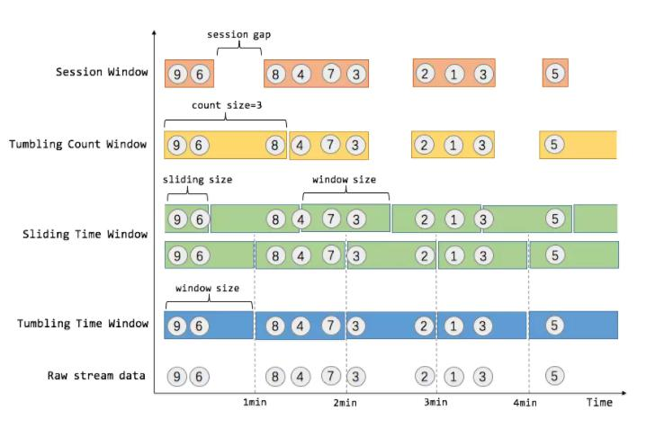
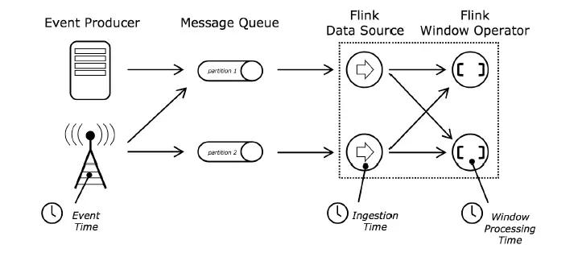
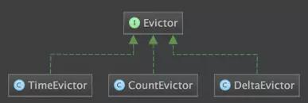
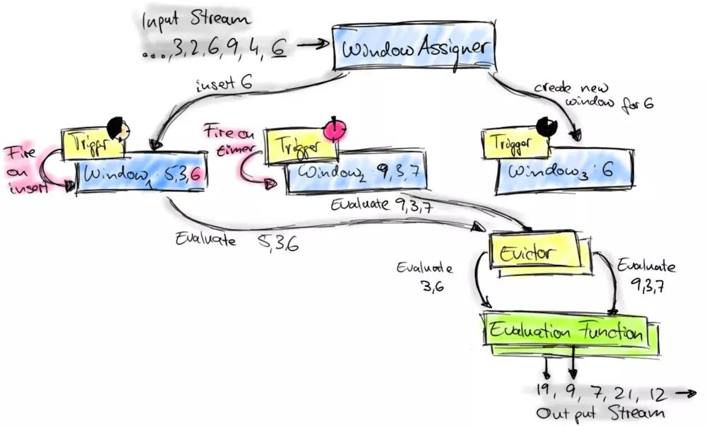
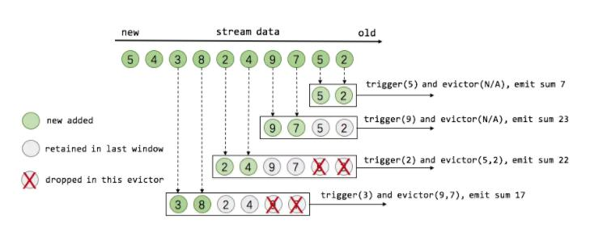

# Flink的Window初探

> Flink 认为 Batch 是 Streaming 的一个特例，所以 Flink 底层引擎是一个流式引擎，在上面实现了流处理和批处理。而窗口（window）就是从 Streaming 到 Batch 的一个桥梁。

## 引言

在流处理应用中，数据是连续不断的，因此我们不可能等到所有数据都到了才开始处理。当然我们可以每来一个消息就处理一次，但是有时我们需要做一些聚合类的处理。

基于窗口驱动方式可分为:

- 时间驱动的（Time Window，例如：每30秒钟）
- 数据驱动的（Count Window，例如：每一百个元素）

基于窗口处理方式可分为：

- 翻滚窗口（Tumbling Window，无重叠）
- 滚动窗口（Sliding Window，有重叠）
- 会话窗口（Session Window，活动间隙）



需要说明的是，Flink将Time分为3种:

- event time（事件时间：事件发生时的时间）
- ingestion time（摄取时间：事件进入流处理系统的时间）
- processing time（处理时间：消息被计算处理的时间）



## Count Window

Count Window 是根据元素个数对数据流进行分组的。

### Tumbling Count Window

当我们想要每100个用户购买行为事件统计购买总数，那么每当窗口中填满100个元素了，就会对窗口进行计算，这种窗口我们称之为翻滚计数窗口（Tumbling Count Window），通过使用 DataStream API，我们可以这样实现：

```
// Stream of (userId, buyCnts)
val buyCnts: DataStream[(Int, Int)] = ...

val tumblingCnts: DataStream[(Int, Int)] = buyCnts
  // key stream by sensorId
  .keyBy(0)
  // tumbling count window of 100 elements size
  .countWindow(100)
  // compute the buyCnt sum 
  .sum(1)

```

### Sliding Count Window

Count Window 也支持 Sliding Window，虽在上图中未描述出来，但和Sliding Time Window含义是类似的，例如计算每10个元素计算一次最近100个元素的总和，代码示例如下:

```
val slidingCnts: DataStream[(Int, Int)] = vehicleCnts
  .keyBy(0)
  // sliding count window of 100 elements size and 10 elements trigger interval
  .countWindow(100, 10)
  .sum(1)

```

## Time Window

### Tumbling Time Window

统计每一分钟中用户购买的商品的总数，需要将用户的行为事件按每一分钟进行切分，这种切分被成为翻滚时间窗口（Tumbling Time Window）。

翻滚窗口能将数据流切分成不重叠的窗口，每一个事件只能属于一个窗口。通过使用DataStream API，可以这样实现：

```
// Stream of (userId, buyCnt)
val buyCnts: DataStream[(Int, Int)] = ...

val tumblingCnts: DataStream[(Int, Int)] = buyCnts
  // key stream by userId
  .keyBy(0) 
  // tumbling time window of 1 minute length
  .timeWindow(Time.minutes(1))
  // compute sum over buyCnt
  .sum(1)

```

### Sliding Time Window

对于某些应用，它们需要的窗口是不间断的，需要平滑地进行窗口聚合。比如，我们可以每30秒计算一次最近一分钟用户购买的商品总数。这种窗口我们称为滑动时间窗口（Sliding Time Window）。在滑窗中，一个元素可以对应多个窗口。通过使用 DataStream API，我们可以这样实现：

```
val slidingCnts: DataStream[(Int, Int)] = buyCnts
  .keyBy(0) 
  // sliding time window of 1 minute length and 30 secs trigger interval
  .timeWindow(Time.minutes(1), Time.seconds(30))
  .sum(1)
```

## Session Window

在这种用户交互事件流中，我们首先想到的是将事件聚合到会话窗口中（一段用户持续活跃的周期），由非活跃的间隙分隔开。如上图所示，就是需要计算每个用户在活跃期间总共购买的商品数量，如果用户30秒没有活动则视为会话断开（假设raw data stream是单个用户的购买行为流）。Session Window 的示例代码如下：

```
// Stream of (userId, buyCnts)
val buyCnts: DataStream[(Int, Int)] = ...
    
val sessionCnts: DataStream[(Int, Int)] = vehicleCnts
    .keyBy(0)
    // session window based on a 30 seconds session gap interval 
    .window(ProcessingTimeSessionWindows.withGap(Time.seconds(30)))
    .sum(1)

```

session 是指一段持续活跃的期间，由活跃间隙分隔开。通俗一点说，消息之间的间隔小于超时阈值（sessionGap）的，则被分配到同一个窗口，间隔大于阈值的，则被分配到不同的窗口。

目前开源领域大部分的流计算引擎都有窗口的概念，但是没有对 session window 的支持，要实现 session window，需要用户自己去做完大部分事情。而当 Flink 1.1.0 版本正式发布时，Flink 将会是开源流计算领域第一个内建支持 session window 的引擎。

在 Flink 1.1.0 之前，Flink 也可以通过自定义的window assigner和trigger来实现一个基本能用的session window。

基于GlobleWindow这个window assigner，将所有元素都分配到同一个窗口中，然后指定一个自定义的trigger来触发执行窗口。这个trigger的触发机制是，对于每个到达的元素都会根据其时间戳（timestamp）注册一个会话超时的定时器（timestamp+sessionTimeout），并移除上一次注册的定时器。最新一个元素到达后，如果超过 sessionTimeout 的时间还没有新元素到达，那么trigger就会触发，当前窗口就会是一个session window。处理完窗口后，窗口中的数据会清空，用来缓存下一个session window的数据。

但是这种session window的实现是非常弱的，无法应用到实际生产环境中的。因为它无法处理乱序 event time 的消息。

Flink 1.1.0 版本中，Flink提供了对session window的直接支持，用户可以通过SessionWindows.withGap()来轻松地定义session widnow，而且能够处理乱序消息。Flink对session window的支持主要借鉴自Google的DataFlow。

## Window API

### Window Assigner

用来决定某个元素被分配到哪个/哪些窗口中去。


Window本身只是一个ID标识符，其内部可能存储了一些元数据，如TimeWindow中有开始和结束时间，但是并不会存储窗口中的元素。窗口中的元素实际存储在 Key/Value State 中，key为Window，value为元素集合（或聚合值）。为了保证窗口的容错性，该实现依赖了 Flink 的 State 机制（参见 state 文档）。

### Trigger

触发器。决定了一个窗口何时能够被计算或清除，每个窗口都会拥有一个自己的Trigger。


Trigger的返回结果可以是 continue（不做任何操作），fire（处理窗口数据），purge（移除窗口和窗口中的数据），或者 fire + purge。一个Trigger的调用结果只是fire的话，那么会计算窗口并保留窗口原样，也就是说窗口中的数据仍然保留不变，等待下次Trigger fire的时候再次执行计算。一个窗口可以被重复计算多次知道它被 purge 了。在purge之前，窗口会一直占用着内存。

### Evictor

可以译为“驱逐者”。在Trigger触发之后，在窗口被处理之前，Evictor（如果有Evictor的话）会用来剔除窗口中不需要的元素，相当于一个filter。



当Trigger fire了，窗口中的元素集合就会交给Evictor（如果指定了的话）。Evictor 主要用来遍历窗口中的元素列表，并决定最先进入窗口的多少个元素需要被移除。剩余的元素会交给用户指定的函数进行窗口的计算。如果没有 Evictor 的话，窗口中的所有元素会一起交给函数进行计算。

上述三个组件的不同实现的不同组合，可以定义出非常复杂的窗口。Flink 中内置的窗口也都是基于这三个组件构成的，当然内置窗口有时候无法解决用户特殊的需求，所以 Flink 也暴露了这些窗口机制的内部接口供用户实现自定义的窗口。





在后面的章节里，我们会从源码剖析Flink的Window机制。


